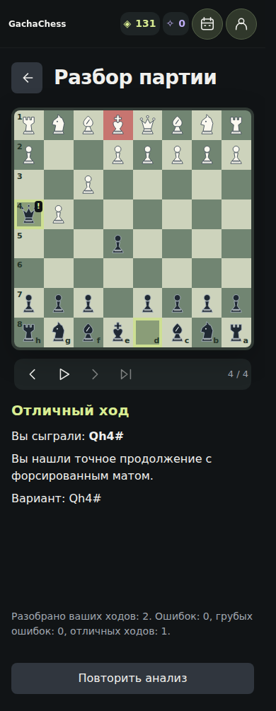
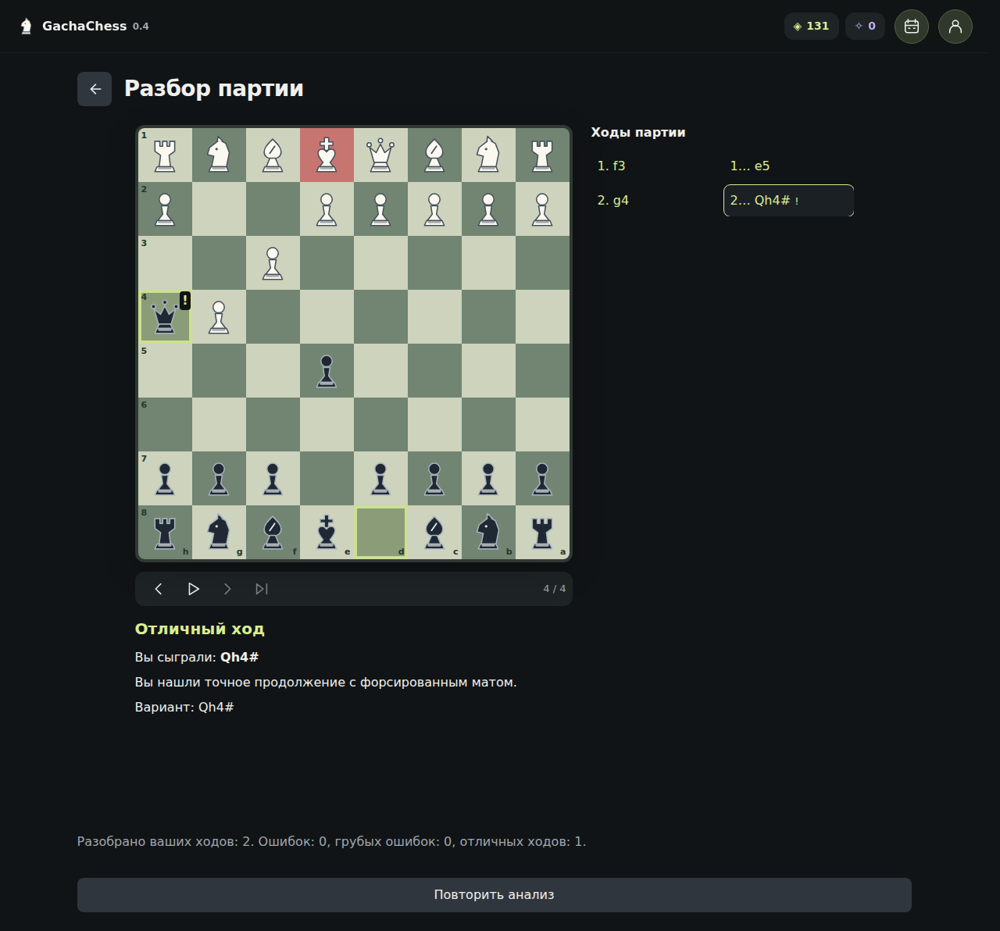

# Локальный разбор завершённой партии

Реализация спецификации v2 в GachaChess 0.4. Подготовленная версия ресурсов PWA — v72.
Исходная публичная версия: `f70fe15` (`OlegKipchatov/chess-builder`, main).

## Границы системы

`analysis-service.js` получает запись архива, воспроизводит PGN и рассчитывает только решения пользователя. Отдельный клиент Stockfish 19 работает через существующий Worker и локальную NNUE. После расчёта клиент завершается. Экран получает готовый `GameAnalysis`; навигация, стрелки и автопаузы не обращаются к движку.

`stockfish-evaluation.js` содержит общую нормализацию WDL и expected score. Экономика использует прежнюю формулу, собственные пороги и профиль без изменения наград.

## Расчёт и интерпретация

- Quick: 75 000 узлов; deep: 300 000; MultiPV 3, Threads 1, Hash 16 MB, WDL включён.
- Если сыгранного хода нет в MultiPV, выполняется отдельный поиск с `searchmoves` и тем же бюджетом.
- Используется полная MultiPV-группа одной глубины. Её ожидаемый размер ограничен числом легальных ходов; для `searchmoves` он равен одному.
- Успешный bounded search требует `bestmove`, оценки фактического хода и легальной короткой PV. Тайм-аут не превращает промежуточные данные в завершённый анализ.
- Deep уточняет ошибки, переходы в мат, потенциально отличные ходы и большой разрыв между верхними вариантами. Его результат полностью заменяет предварительный. Уже проигранная матовая позиция сама по себе не требует повторного глубокого поиска.
- Качество: best / good / inaccuracy / mistake / blunder по потере ожидаемого результата. Forced move всегда best без похвалы и автопаузы.
- Мат классифицируется отдельно: допущенный, упущенный, сохранённый, уже существовавшее поражение. Отличный ход требует подтверждённой значимости; учитывается и единственное найденное матовое продолжение при насыщении WDL.
- Материал проверяется только на воспроизводимых PV до четырёх полуходов. При нехватке доказательств используется нейтральное объяснение.
- Рекомендации: не более двух альтернатив; практически равноценный сыгранный ход не объявляется ошибкой.

## Просмотр

Запуск только из просмотра архивной партии. Предложение анализа в post-game отключено по запросу пользователя. Начальная позиция — 0 / N. Ориентация и оформление берутся из архивной записи. Переиспользуются renderBoard, positionAt, animateTransition, moveNavigation и createDialog.

Ручные переходы мгновенные. Автовоспроизведение ожидает завершения анимации, затем останавливается на выбранном событии. Prev / Next / выбор хода прекращают автовоспроизведение. Поддерживаются стрелки клавиатуры и reduced motion.

Insight показывает один главный смысл, сыгранный ход, короткое объяснение, рекомендуемую альтернативу и PV. Проценты ожидаемого результата скрыты; WDL остаётся внутренней метрикой классификации. Обычные best/good отображаются нейтрально как «Ваш ход», а похвала «Отличный ход» сохраняется только для значимых highlights. Равноценные продолжения описываются без упоминания движка.

Основной вариант и дополнительные продолжения доступны как кнопки. Выбор приостанавливает playback, показывает позицию **до** сыгранного хода и одну стрелку первого хода выбранного варианта. Выбранная кнопка отмечена через aria-pressed. Кнопка «К сыгранному ходу» восстанавливает фактическую позицию; Prev / Next / Play также выходят из предпросмотра. Номер разбираемого хода сохраняется, а подпись явно обозначает позицию перед ходом. Просмотр стрелок не обращается к Worker и не меняет сохранённый анализ.

На мобильном список ходов скрыт по существующей responsive-модели. Нижняя навигация скрыта на экране разбора. Зарезервирована минимальная высота insight; нет графика оценок, звуков и настроек движка.

## Выбор остановок

Максимум восемь событий: сначала мат, затем крупнейшие грубые ошибки, ошибки, значимые положительные моменты (не более двух). Все оценки остаются доступны при ручном просмотре.

В спецификации обязательная остановка на каждом мате/blunder пересекается с ограничением восьми остановок. В реализации ограничение применяется к списку focusEvents, затем остановка обязательна для каждого выбранного события. Положительные события не вытесняют более приоритетные матовые события.

## Хранение и lifecycle

Результат сохраняется в `archiveEntry.analysis` внутри `chess-vault-v3`, и миграция состояния сохраняет это поле. Совместимость проверяется по analysisVersion, profileVersion, engine.version, NNUE, ID партии, цвету игрока и исходному PGN. Повторный запрос совместимого complete не создаёт Worker. Partial/failed можно повторить.

Каждый поиск связан с jobId, requestId и moveIndex. Контроллер экрана дополнительно проверяет generation перед сохранением. Закрытие, смена страницы, повторный запуск и pagehide отменяют работу; поздние ответы не применяются. Сохранение объединяется с актуальным состоянием, чтобы не потерять параллельно начисленный экономический бонус.

Сохраняются короткие варианты и доменные оценки. UCI-поток и измерения отдельных поисков не записываются в localStorage. При переполнении хранилища используется существующее сообщение об ошибке, прогресс не удаляется.

## Проверка

- `npm test`: **204 теста прошли**. Доменная модель, оба цвета, mate semantics, best cluster, forced move, outside MultiPV, deep replacement, события, отмена, stale replies, совместимость, восстановление архива, нейтральные подписи обычных ходов, выбор вариантов и ориентация стрелок; регрессия партии Reina и проверка мата в два против всех ответов.
- Реальный Stockfish: матовая партия за оба цвета.
- Шахматные границы: promotion с UCI-суффиксом, castling, en passant, stalemate, threefold, 50-move draw, insufficient material, короткая партия, сдача и технически неучтённые партии.
- `npm run test:pwa:browser`: онлайн-установка → холодный офлайн-запуск → оба режима ИИ → архив → настоящий анализ в Worker без сети → сохранение → повторное открытие без Worker → playback → завершение post-game без предложения анализа → история → отмена.
- Обновление с реального v71 на v72: неудачная установка сохраняет старую версию; успешная установка сохраняет активную партию, старые URL, пользовательский прогресс и посторонние кэши.
- Браузерные проверки 320, 390 и 1280 px, увеличение текста до 200%: отсутствие горизонтального переполнения и визуальный просмотр скриншотов.

## Производительность

`node scripts/benchmark-analysis.mjs docs/analysis-benchmark-linux.json` воспроизводит замер 20/40/80 полных ходов. Синтетические легальные PGN включены в JSON. Подготовка фикстур исключена из измерения; обработка длинного PGN в сервисе отдаёт управление между порциями ходов.

Это диагностика Linux x86_64 с Node-клиентом и Stockfish WASM в отдельном процессе, **не** замер браузерного Worker на Apple Silicon или iPhone. Суммарное время решения включает оба прохода и дополнительный поиск фактического хода. Node event-loop delay не эквивалентен задержке кадров браузера. Память движка остаётся null, если среда не предоставляет метрику RSS.

Замеры на физическом Apple Silicon, современном iPhone и старом поддерживаемом iPhone остаются обязательной задачей калибровки. До них бюджеты 75k/300k считаются стартовыми, а обещание фиксированного времени разбора не даётся.

### Результаты диагностического запуска

| Полных ходов | Общее время | Среднее на решение | p95 | Максимум | Задержка Node event loop |
| --- | --- | --- | --- | --- | --- |
| 20 | 21.0 с | 1042 мс | 1310 мс | 1316 мс | 15 мс |
| 40 | 36.5 с | 904 мс | 1321 мс | 1402 мс | 26 мс |
| 80 | 54.0 с | 664 мс | 1358 мс | 1425 мс | 31 мс |

Все три партии разобраны полностью. RSS движка в этой среде недоступен.

## Внешний вид

# Mate opportunity refinement

The v2 analysis cache invalidates v1 results. A mate-to-CP transition no longer
automatically raises decision quality to mistake. With loss <= 0.025 it becomes
a neutral `mate_opportunity`; actual larger WDL losses retain their normal quality.
Mate in one/two is checked against every legal defence, yielding between replies
and respecting cancellation. A bounded search not finding mate is not evidence
that no longer mate exists. Consecutive player opportunities form one autoplay
episode; every individual insight remains accessible. Real losses remain separate.
Selecting the suggested line shows the pre-move board and one next-move arrow.
Variation controls step through its saved PV (including the mating position),
without invoking Stockfish or changing game history. Return/history controls
restore the actual game. Regression coverage includes the supplied Reina PGN.
